piliko
======

Piliko is a mish mash collection of highly experimental Geometry codes, 
mostly inspired by Rational Geometry. Most of the code tries to avoid 
irrational and transcendental numbers and functions as the basis of 
calculations.

#Current status

The code is bits and pieces, like a workshop or notebook, of various things.
This code is 'alpha' level. It is highly experimental. It may or may not 
work at any time. 

The main 'piliko' python code contains experimental implementations of 
rational geometry functions like spread, red, blue and green quadrance, 
circumcenters of a triangle, etc. The whole type system has not been 
thought out very carefully and many functions are partially or wholly 
unimplemented. Tests have not been created.

There are also a lot of random tidbits not related to the main piliko 
package, for example, some experiments:

* Make rational number types that allow 0 as a denominator, in the Go language
* Generate Sphere, Torus, tessellations of disks, Bernoulli 
  Leminscate, etc, using only rational points, and also using Blue,Red,Green
  quadrance as short-hand notation for generation formulas.
* Draw patterns of pythagorean triples
* Find line-line intersection using the Wedge function of Geometric Algebra
* Find conic equation of a spline, given 3 points, using
 Rob Johnsons "Conic Splines" paper of 1991, from Apple
 and http://sympy.org , a symbolic python mathematics package
* Draw Ford Circles
* Show non-obvious facts about using floating-point IEEE numbers
 to model geometry, like the fact that the length of an object varies
 depending on its position in space
* Generate 3d OFF files of Ellipson shape (from Wildberger's Divine Proportions)
* Geodesic sphere based on Icosahedron

#Disclaimer 

Rational Trigonometry was discovered and developed by Dr. Norman J 
Wildberger. His concepts and terminology are used here without 
permission and the use of these ideas/terms doesn't imply his 
endorsement nor his affiliation. All apologies if there are mistakes
which are entirely this authors and not his. 
Please see these sites for more information:

* https://www.youtube.com/user/njwildberger
* http://web.maths.unsw.edu.au/~norman/
* http://www.wildegg.com
* http://www.cut-the-knot.org/pythagoras/RationalTrig/CutTheKnot.shtml
* http://farside.ph.utexas.edu/euclid.html

The author of this code is not an expert.

#Piliko Examples

First, get python up and running, using any of the hundreds of tutorials
from a web search. Then do this

	from piliko import *

	p1,p2,p3 = point(0,0),point(3,0),p3 = point(0,4)
	print quadrance(p1, p2)
	L1 = line( p1, p2 )
	L2 = line( p1, p3 )
	s = spread( L1, L2 )
	print s

	t = triangle(point(0,0),point(4,3),point(2,5))
	oc,cc,nc = orthocenter(t),circumcenter(t),ninepointcenter(t)
	print oc,cc,nc
	print collinear( oc, cc, nc )
	
	p1,p2,p3,p4 = point(0,0),point(3,0),point(2,0),point(6,0)
	print is_harmonic_range( p1, p2, p3, p4 )

	p=point(3,4)
	bq,rq,gq=blue_quadrance(p),red_quadrance(p),green_quadrance(p)
	print p,' ',bq,rq,gq,' ',sqr(bq),sqr(rq),sqr(gq)

To run files under example folder:

        export PYTHONPATH=. # linux only, not sure how to do on Windows
        python examples/example02.py

When the add-on 'matplotlib' package is installed on your system, you can do
some basic plotting of pictures. For example:

	t = triangle(point(0,0),point(4,3),point(2,5))
	oc,cc,nc = orthocenter(t),circumcenter(t),ninepointcenter(t)
	circ = circle( oc, blueq( oc, point(0,0 ) )
	plot_circle( circ )
	plot_points( oc,cc,nc )
	plot_triangle( t )
	plotshow()

#Differences with real-number geometry

Geometry under rational numbers is different than 'ordinary' geometry using
the real numbers. Here are some interesting and fun comparisons.

```
Real                               Rational
----                               --------

The real number line is            The Rational line is fundamental
fundamental and used               and irrationals are avoided.
in calculations

Points can have any                Points can only have Rational
coordinates                        coordinates

Distances are fundamental          Quadratic Forms (Quadrance)
sqrt(x^2+y^2)                      are fundamental. x^2+y^2.
                                   Distance is derived from Quadrance by 
                                   finding a square root, which is not
                                   always possible if it's not a perfect square

The point 1,1 is on                There is no circle centered at
a circle with center 0,0           0,0 containing the point 1,1 with a rational
                                   radius

Any line with points inside        Some lines with points inside
the circle intersects the          the circle won't intersect it
circle                             at rational points in x,y coordinates

Infinite series approximations     Finite bit-width numbers are 
are used in calculations.          considered the base of calculations

e + pi is considered as            e and pi are both infinite series
a number (of unknown nature)       so an attempt is made to avoid them

Angles are used to measure         Spread is used (sin squared)
line separation

Angles can be simply added.        Spreaded lines are combined using
                                   spread polynomials.

The basic right triangles are      Basic right triangles are the Pythagorean
45-45-90, 30-60-90, 60-60-60       triple triangles, like 3,4,5  5,12,13, etc. 
(angle based) with irrational      Many angle-based triangles have irrational 
lengths.                           points.

Wedge between vectors can be       Wedge between vectors is focused on
expressed with 'sin'               the rational calculation, x1*y2-x2*y1

Regular polygons are specified     Many regular polygons have irrational
by angles added.                   points and so can only be approximated

Hyperbolic, Elliptical,            Hyperbolic, Elliptic, and Spherical
Spherical are special cases        geometry share many of the same formulas
with very different formulas       and ideas.

Circles are described with         Circles are described using
sine and cosine approximations     rational paramterizations

Infinite series and sets are       Infinite series and sets are avoided
commonplace

Infinity is something we cant      Infinity can be dealt with using
deal with concretely               projective geometry (points-at-infinity map
                                   to finite points in 'ordinary' space, perhaps
                                   of a lower dimension)

Tangents can have any slope        Tangents have rational slope
                                   
Tangents exist at every point      Tangents exist at rational points


```

# Pictures

Reproducing a graph from Wildberger's Chromogeometry paper, 2008
* https://www.researchgate.net/publication/225963299_Chromogeometry
This is program generated, using python functions to generate circle centers, 
hyperbolas, etc.

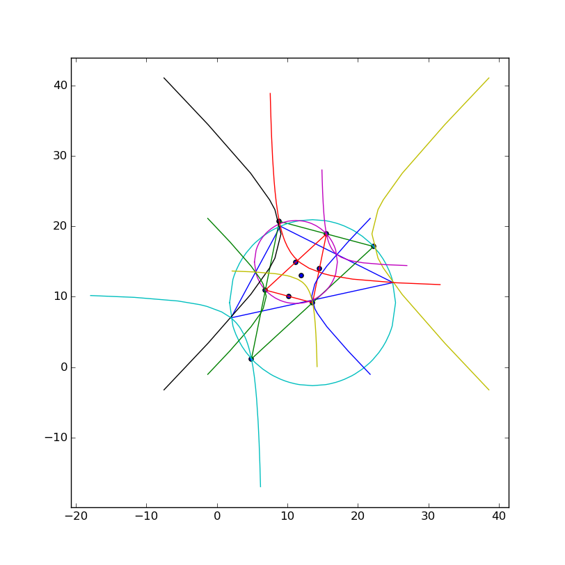

Now, doing it again with random triangles (to show it works)

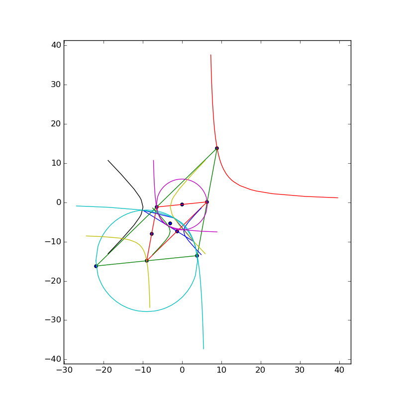
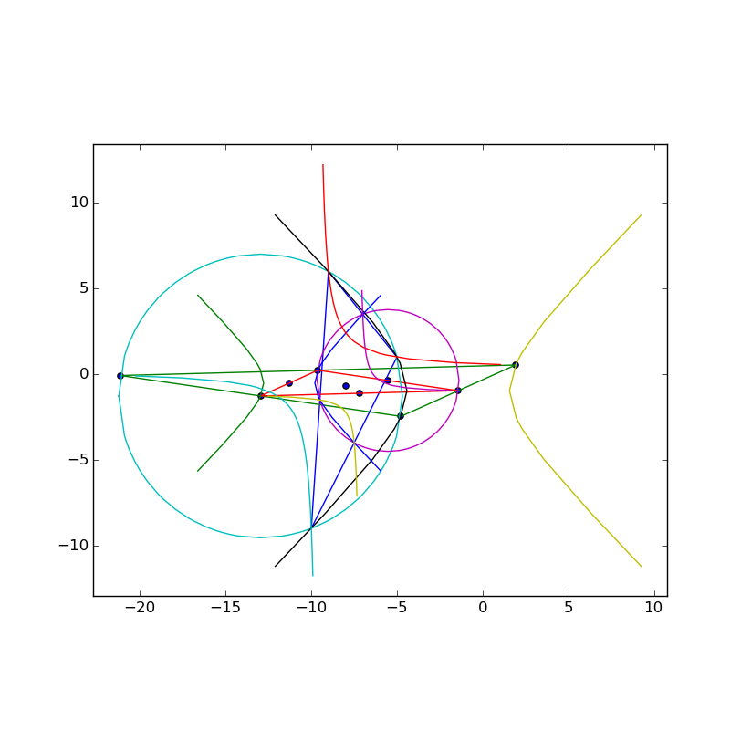

And again... this time with the liberty of using top-bottom hyperbolas

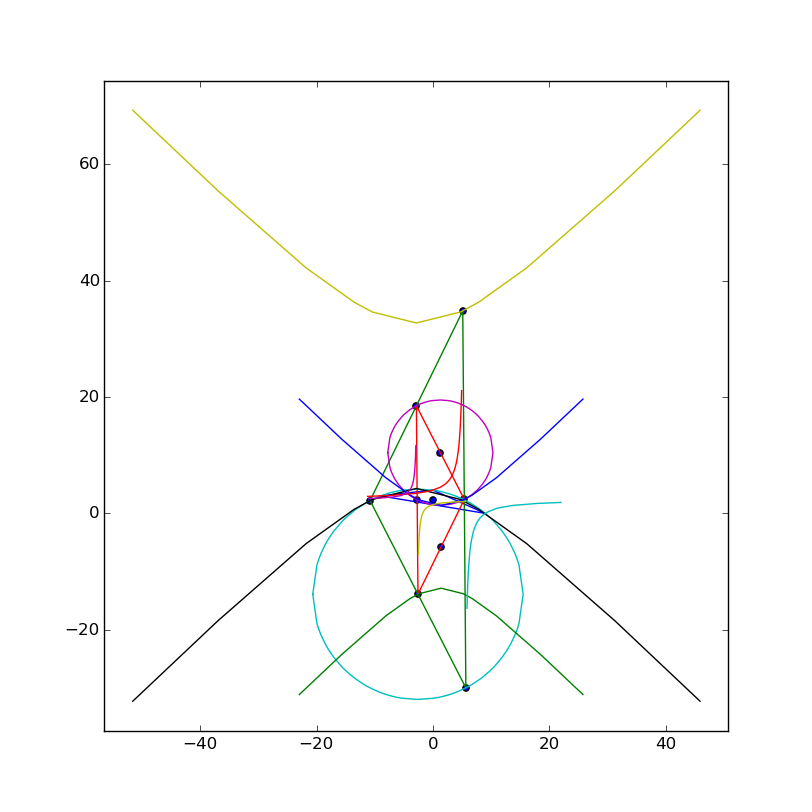

Bernoulli lemniscate, rotated around an axis in 3d (all rational points)
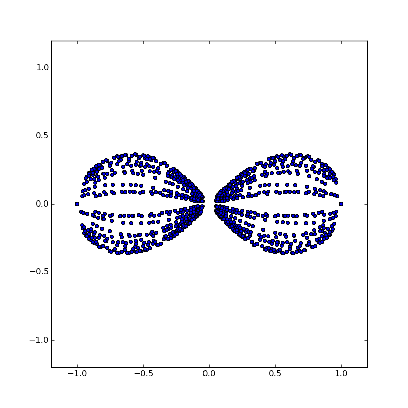

Ellipson, a 3d shape from Wildberger's Divine Geometry, rendered with
Meshlab and the render setting of the "glass" Shader
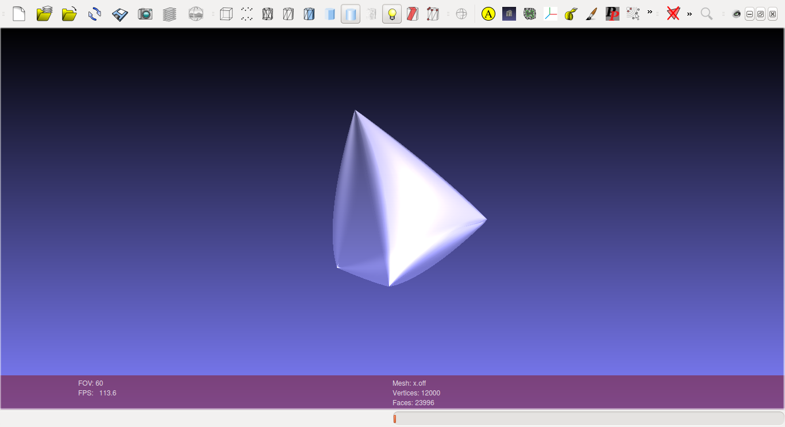
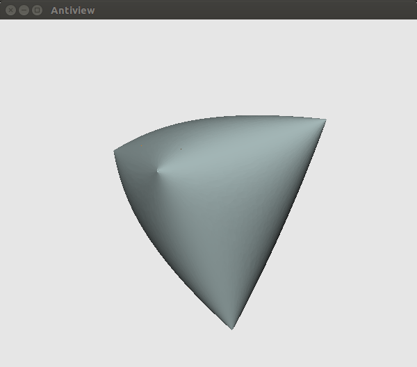

Hyperbolic sheet, rational points
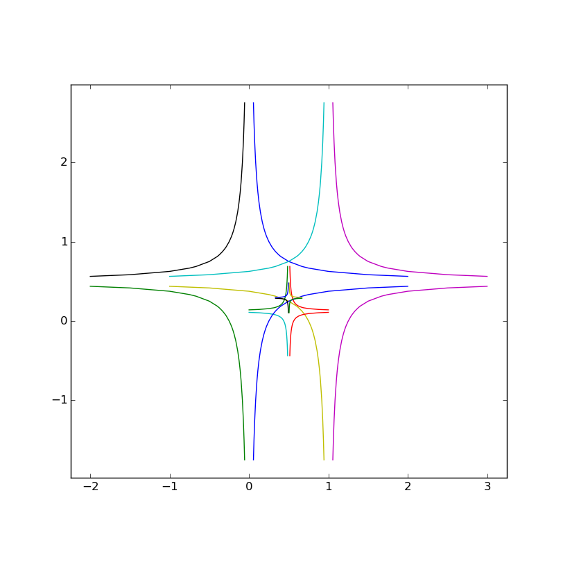
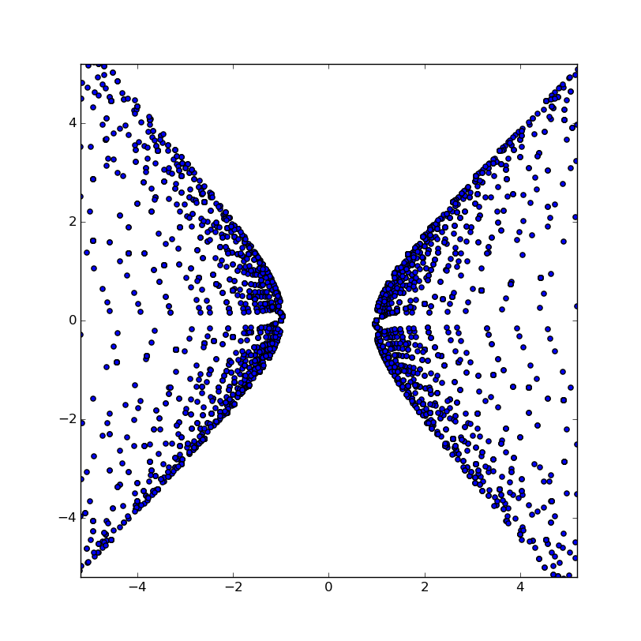

Various Pythagorean Triple patterns
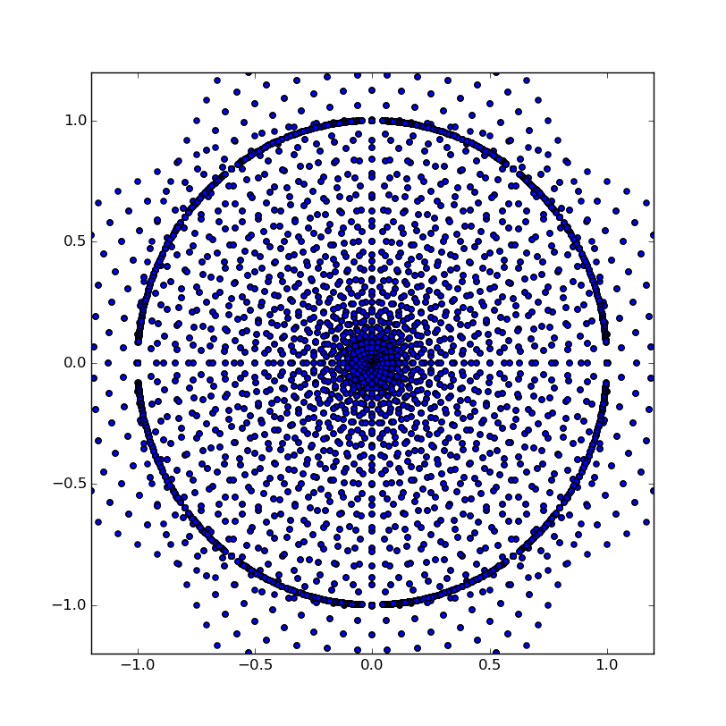
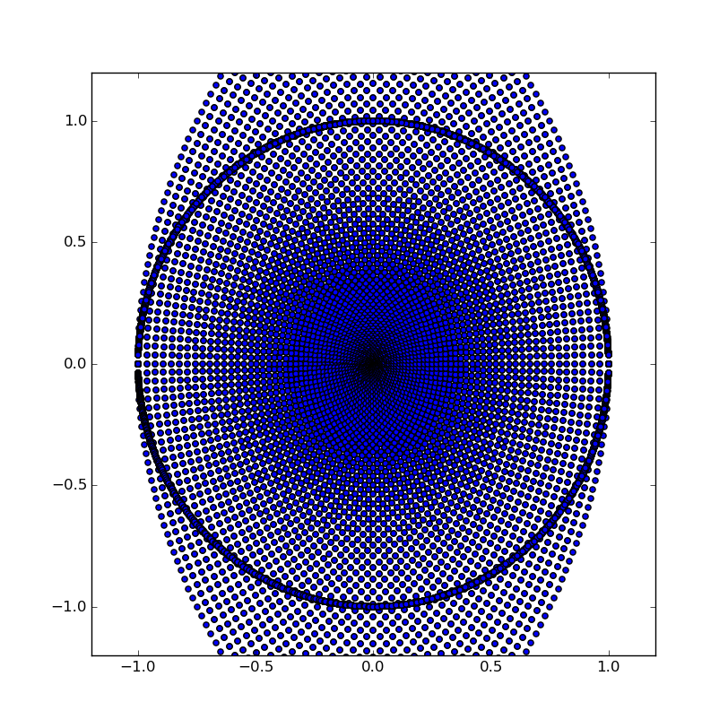
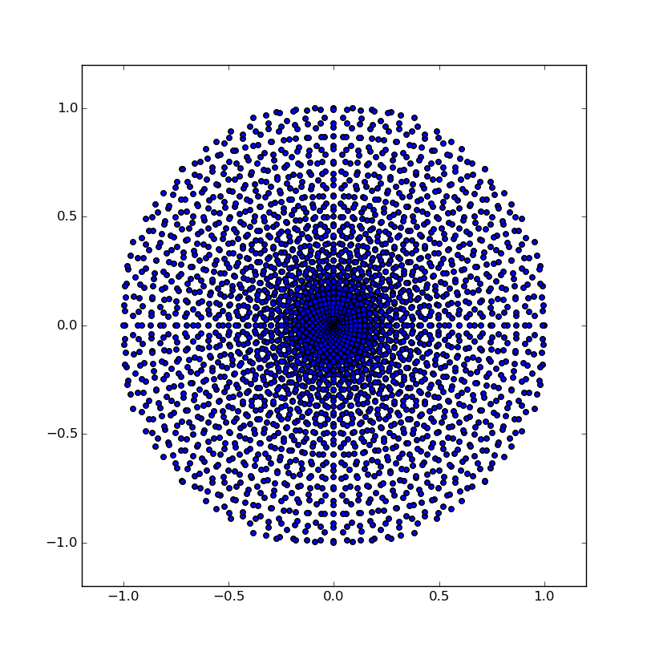
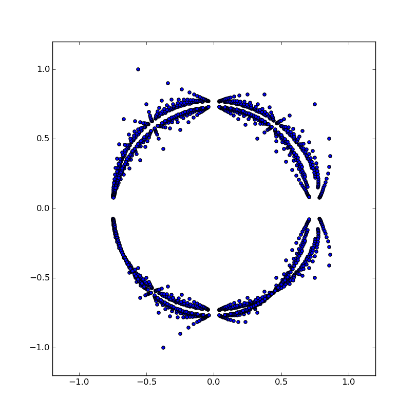

Sphere, Torus, rational points
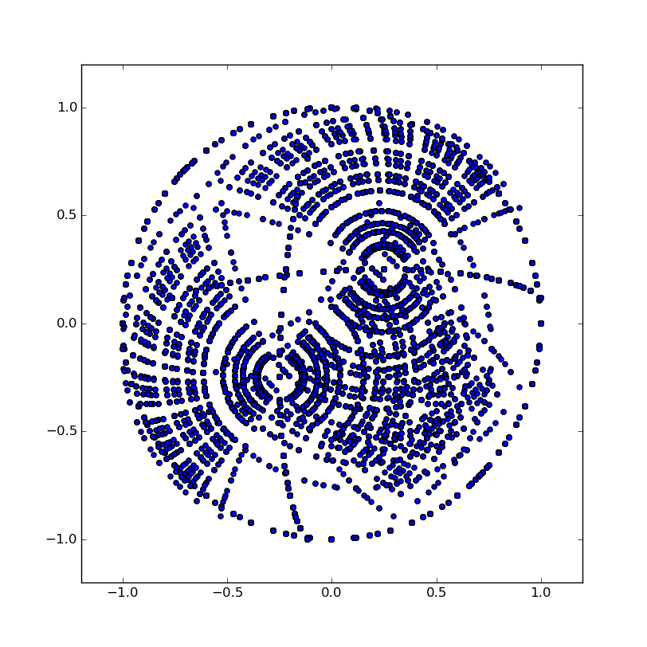
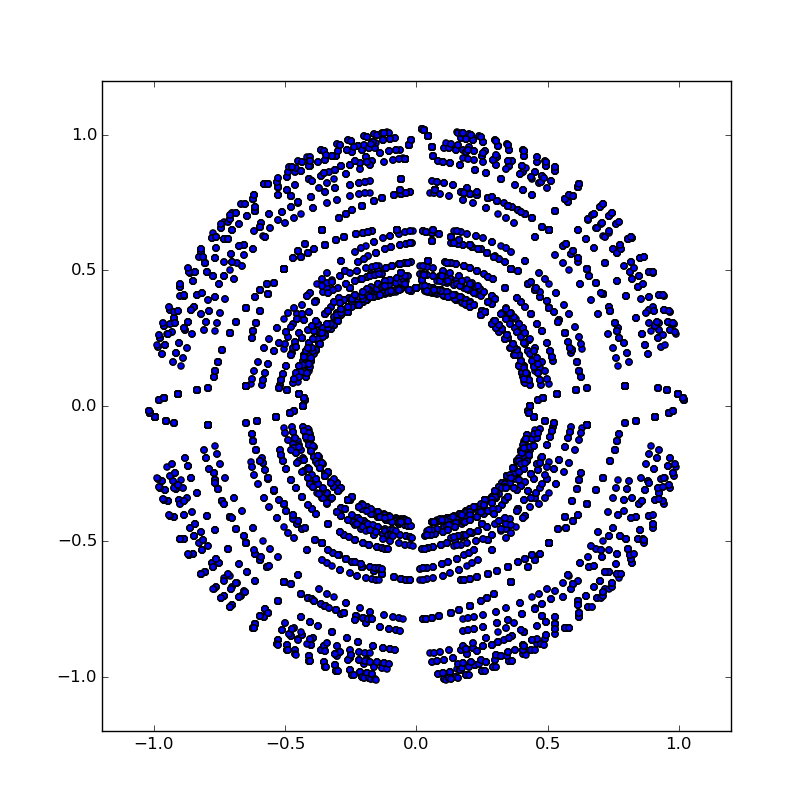

Warped torus, created by slightly altering the rational parameterization
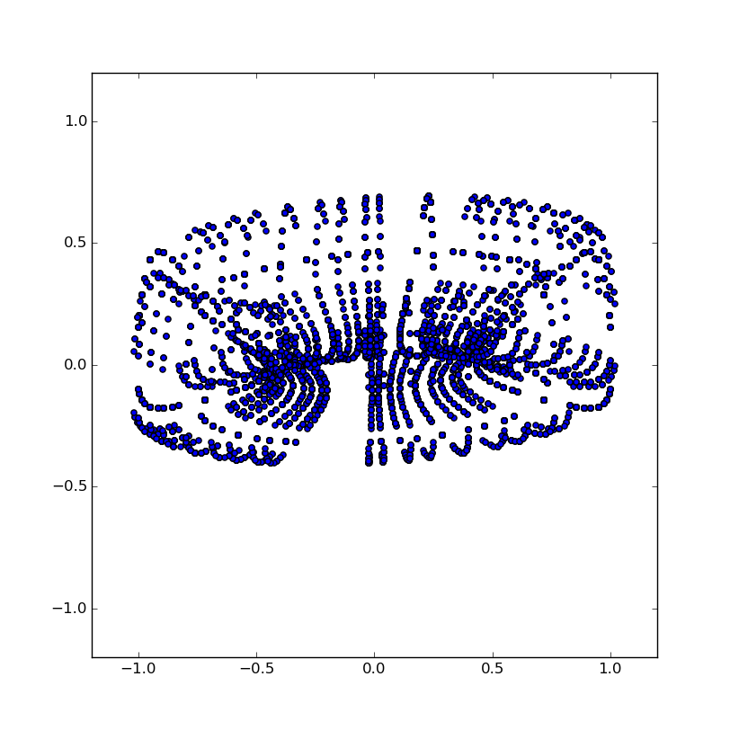

# Copyright License
=================

All computer code here is as of writing by Don Bright, 
github.com/donbright 2013-2016. Many formulas have been taken from other 
places, with attirbution in the code.

This code is free for use under a basic BSD-style Open Source Software 
license as described in the LICENSE file. You can freely copy and use it
per the terms in that LICENSE file.
